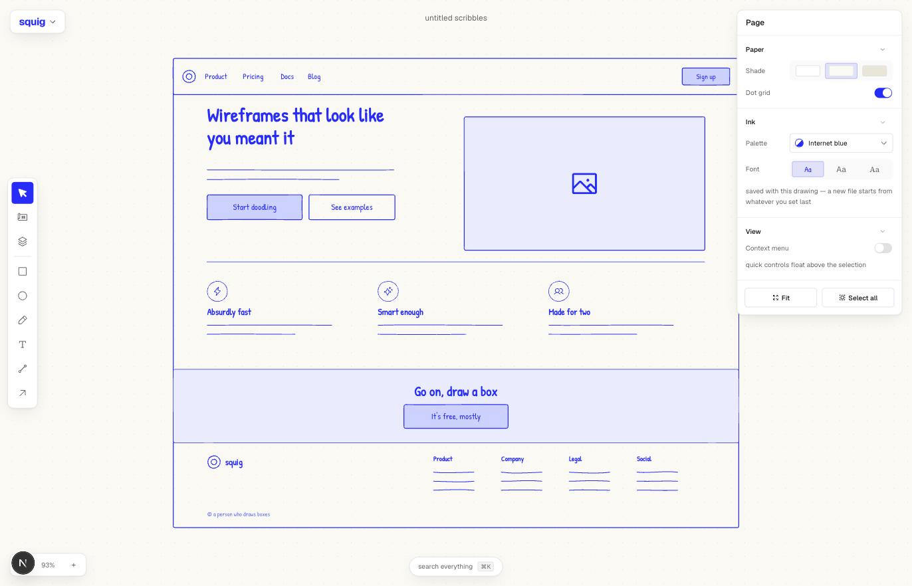
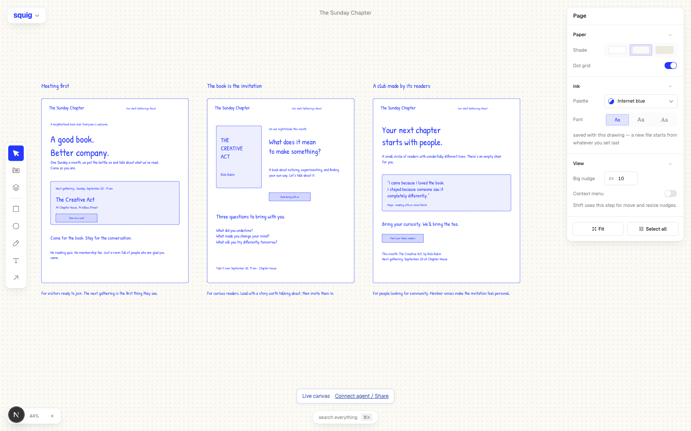

# squig

A wireframing tool for people who think by drawing.

**[Try it live at squig.sh →](https://squig.sh)**



Open Figma and you get sucked into high fidelity. Open tldraw and you're
hand-drawing every button from scratch. squig sits in between: an infinite
canvas where you drag in real UI components, but everything renders as a
hand-drawn sketch.

The sketchy look is the whole point. It's a napkin, not a mockup — nothing
looks decided, so people give feedback on the idea instead of the corner
radius, and you can try a layout three ways in the time one polished version
takes.

## What's in it

**Infinite canvas.** Pan, zoom, multi-select, marquee, smart-guide snapping,
keyboard nudge, undo/redo. Everything you'd expect.

**A real component library.** The shadcn/ui vocabulary — buttons, inputs,
selects, switches, tables, dialogs, tabs, nav, sidebars — plus blocks (heroes,
pricing, FAQ, AI chat, checkout, kanban) and whole screen templates.

**Everything is a component with variants.** Drop a button, and the inspector
flips it: icon left, icon right, size, filled or outline. It stays a component
while you do that — you're switching variants, not editing shapes.

**Break apart when you need to.** If no variant covers what you want, break the
component and its pieces become editable primitives. One-way, on purpose.

**⌘K searches everything.** Tools, actions, and every component and block, in
one sheet. Enter drops it in the middle of your view.

**Paste whatever you've got.** ⌘V takes the clipboard and puts it where the
pointer is: a screenshot to wireframe around, a paragraph of copy, or layers
copied out of another squig tab. Pictures land as themselves inside a drawn
frame — a reference you can't read is no reference — and get shrunk on the way
in, so a retina screenshot doesn't eat the drawer.

**Your files stay in your browser.** Every document autosaves as you draw, and
the file menu keeps a list of the recent ones to open again. New file starts a
new document rather than painting over the last one. The drawer holds the last
forty; past that, and when the browser runs out of room, the oldest ones go.
Local files need no accounts or cloud — clearing site data clears them, so
Export a copy (`⇧⌘S`) is there when a file matters.

## Keyboard

Figma's, so your hands already know it. `?` opens the full list in the app.

| | |
|---|---|
| `V` `R` `O` `P` `T` `L` | select, rectangle, ellipse, draw, text, arrow |
| `C` / `B` | components / blocks panel |
| `⌘K` / `⌘/` | search everything (`⌘K` over text links it instead) |
| `⌘Z` / `⇧⌘Z` | undo / redo |
| `⌘D`, `⌥`-drag | duplicate |
| `⌘C` `⌘X` `⌘V` / `⇧⌘V` | copy, cut, paste at cursor / paste in place |
| `⌘G` / `⇧⌘G` | group / ungroup — groups can nest; ungroup detaches an instance |
| `⌥⌘B` | detach instance |
| `⌘`-click, double-click | deep-select / step one level into a group |
| `⌘]` / `⌘[` | bring forward / send backward |
| `⌥⌘]` / `⌥⌘[` (or `]` / `[`) | bring to front / send to back |
| `⇧H` / `⇧V` | flip horizontal / vertical |
| `⌘B` `⌘I` `⌘U` | bold, italic, underline |
| `⌘S` / `⇧⌘S` | save to this browser / export a copy |
| arrows (`⇧` for the big nudge) | move by 1px / the custom big nudge (10px by default) |
| `⌘`-arrows (`⇧` for the big nudge) | resize by 1px / the custom big nudge |
| space-drag, middle-drag | pan |
| `⌘+` / `⌘-`, `⌘`-scroll | zoom the canvas, never the browser |
| `⇧0` `⇧1` `⇧2` | 100%, fit, selection |
| `⌘\` | hide the interface |

## Running it

```bash
pnpm install
pnpm dev
```

The local canvas needs no environment variables, database, or accounts — those
documents live in browser storage. The optional agent workspace server uses
Postgres; see Squig for agents below. `pnpm test` type-checks and runs the geometry,
selection and clipboard suites; `pnpm lint` and `pnpm build` are the other two
worth running before you push.

## How it's put together

Documents are a flat map of nodes on an infinite plane. Groups—including
subgroups—are hierarchy paths stamped onto those nodes rather than container
nodes, so there is still no layout nesting or flow layout. A node is a
component instance, a shape, a freehand stroke, text, or an arrow.

Components never render to DOM. Each one is a `ComponentDef` whose `render()`
returns an array of drawing primitives (`rect`, `line`, `text`, `icon`, …),
which the canvas draws through [rough.js](https://roughjs.com) into SVG. That
one indirection buys a lot: previews in the panel, ⌘K thumbnails, and
break-apart all reuse the exact same primitives the canvas draws.

Icons are Phosphor paths, rendered crisp rather than roughened — at 14px the
wobble just reads as mush.

To add a component, write a `ComponentDef` and add it to an array. See
[`lib/library/AUTHORING.md`](lib/library/AUTHORING.md).

```
app/                     the single page
components/canvas/       canvas, interactions, rough.js renderer
components/chrome/       rail, panels, inspector, ⌘K, menus
lib/sketch/              drawing primitives + Phosphor icons
lib/library/             every component and block definition
lib/canvas/snap-engine   alignment/snapping math
lib/store.ts             zustand doc state + history
lib/files.ts             the local file drawer — autosave, recents, prefs
```

## Stack

Next.js, React, TypeScript, Tailwind, shadcn/ui for the tool's own chrome,
rough.js for the sketch rendering, Phosphor for icons.

## Contributing

Pull requests are welcome — [CONTRIBUTING.md](CONTRIBUTING.md) covers the
setup, what tends to get merged, and how to add a component, which is the
easiest place to start. If you're about to spend real time on something, open
an issue first.

## License

[MIT](LICENSE) © Pablo Stanley

## Squig for agents



External agents draw on the same Squig canvas as the user. Open a canvas and
click **Connect agent** to connect any compatible MCP client or HTTP agent.
Watch it add real editable wireframes and notes, and edit alongside it.
An agent with a workspace key can also create a new canvas and send its
editable link before drawing. Keep variations side by side on that canvas.

- **[Open a canvas](https://squig.sh)** — connect an agent to your current drawing.
- **[Workspace keys](https://squig.sh/connect)** — let an agent create canvases.
- **[MCP setup](https://squig.sh/docs/mcp)** — Codex, Claude Code, Cursor, and
  other Streamable HTTP clients. Endpoint: `https://squig.sh/mcp`.
- **[API documentation](https://squig.sh/docs/api)** and
  **[OpenAPI](https://squig.sh/openapi.json)** — the same commands over REST.
- **[Agent-readable docs](https://squig.sh/llms-full.txt)** — the complete
  workflow, document model, constraints, and setup.
- **[Plugin](plugins/squig)** — an installable Codex plugin and wireframing skill.

Agent workspaces are saved in Postgres. Ordinary local drawings still work
without a key or database. Sharing a local canvas creates an online copy.
Workspace keys grant access to the workspace. Canvas keys and editable links
grant access to one canvas. Treat keys and invitation links as secrets.

For a self-hosted agent server, set `DATABASE_URL` to your Neon database and
`SQUIG_PUBLIC_URL` to your instance origin, then run:

```bash
pnpm install --frozen-lockfile
node --env-file=.env.local scripts/agent/migrate.mjs
pnpm dev
```

The migration is additive and idempotent. Test the command engine with
`pnpm test:agent`; test MCP and REST against a running server and the real
database with `node --env-file=.env.local scripts/agent/smoke.mjs`.
The smoke test creates isolated fixtures and deletes them afterward. Set
`SQUIG_TEST_URL` to change its default `http://localhost:3001` target.

Install the plugin from this repository:

```bash
codex plugin marketplace add .
codex plugin add squig@squig-plugins
```

Set `SQUIG_API_KEY` privately in your agent's environment and start a new task.
No production code is generated or deployed by Squig's tools. Your coding
agent handles implementation after the human chooses a direction.
